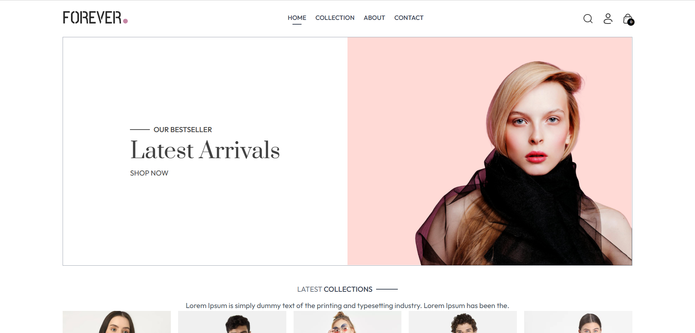
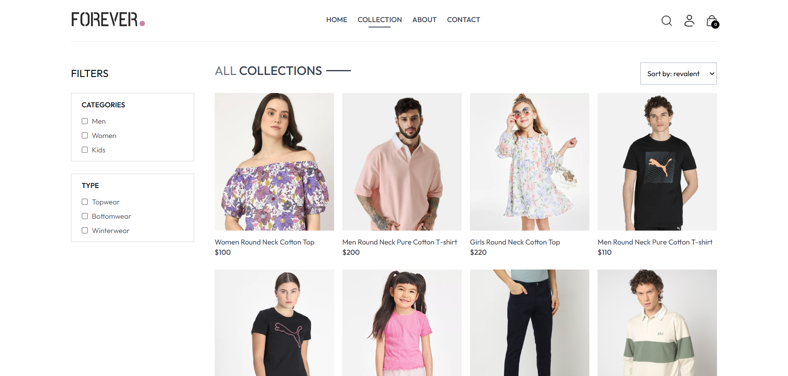
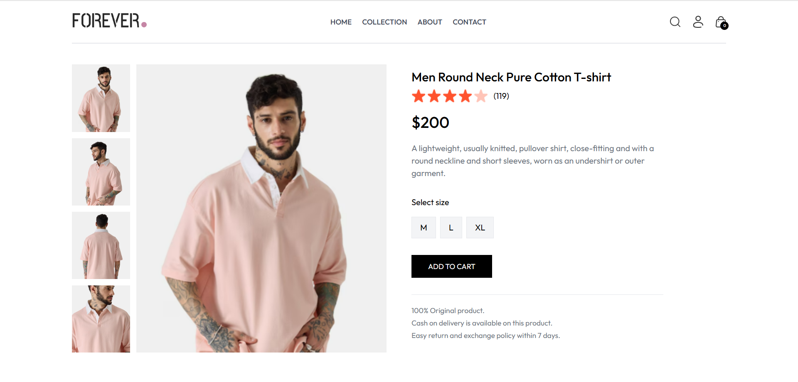
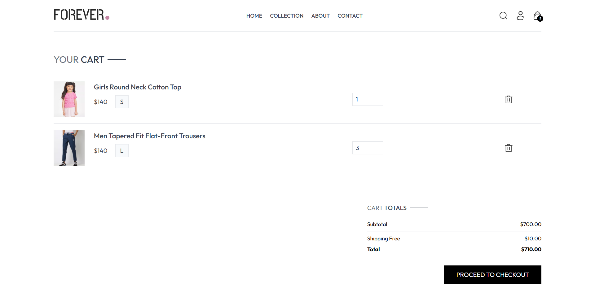
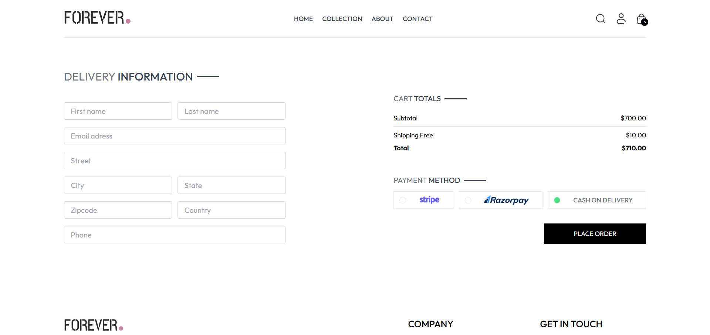
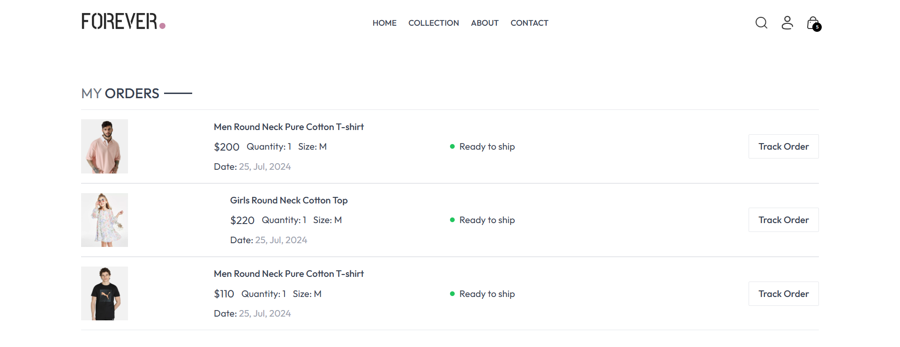
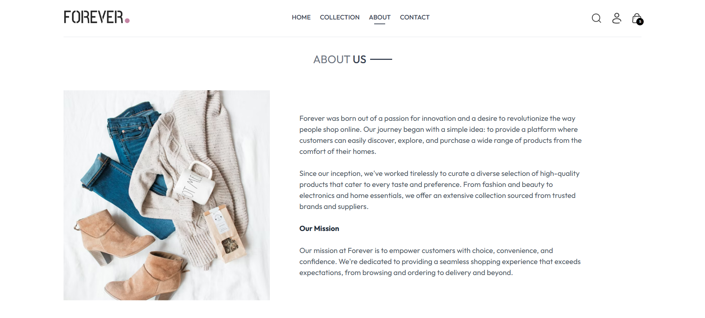
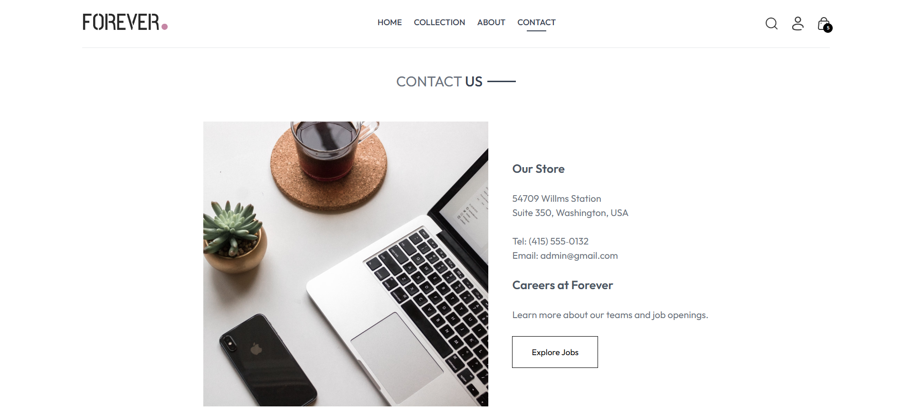

# Fashion E-commerce Frontend

## Description

Fashion E-commerce Frontend is a modern, responsive web application. Built using React, Tailwind CSS, and Vite, it simulates an online clothing store. The application includes key e-commerce features such as product browsing, filtering, sorting, cart management, and order placement — all rendered dynamically from local JSON data without backend integration. The goal of this project was to apply practical frontend development skills, create reusable components, and ensure a mobile-first, intuitive shopping experience.

## Features

- Browse products by category and type
- Sort by price or relevance
- Product detail pages with size selection
- Interactive shopping cart with quantity and total calculation
- Checkout form and mock order confirmation
- Pages: Home, Collection, Product, Cart, About, Contact, Login, Register
- Fully responsive (mobile-first) design
- Uses React Context API for state management
- Simulated data from local JSON files

## Visuals

### Home Page

Displays latest products, bestsellers, and newsletter signup.


### Collection Page

Filter products by category (men, women, kids) and sort by price or popularity.


### Product Detail Page

View detailed product info, choose size, and add to cart.


### Cart Page

Shows selected items, allows quantity update or removal, and displays total cost.


### Place order Page

Form to enter delivery and payment details.


### Orders Page

Mock view of past orders (UI only, no backend).


### About Page

Shows store mission and values.


### Contact Page

Contact info and discount subscription form.


## Tech Stack

- [React](https://reactjs.org/)
- [Tailwind CSS](https://tailwindcss.com/)
- [Vite](https://vitejs.dev/)
- [React Router](https://reactrouter.com/)
- [React Toastify](https://fkhadra.github.io/react-toastify/)

## Installation

### Prerequisites

Before setting up the project, ensure that you have the following installed:

- Node.js
- npm (comes with Node.js)

1. **Clone the repository:**

   ```bash
   git clone <repository-url>
   cd <project-folder>
   ```

2. **Install dependencies:**
   ```bash
   npm install
   ```
3. **Start the development server:**
   ```bash
   npm run dev
   ```

## Usage

After starting the development server, open [http://localhost:5173](http://localhost:5173) in your browser.

Here’s what you can do in the app:

### Home Page

Displays latest arrivals, bestsellers, and a newsletter form.

**Example:**

- Scroll to see featured items.
- Click on a product to view details.

### Product Listing (`/collection`)

Filter and sort items by category, type, or price.

**Example:**

- Select "Men’s" category and "Outerwear" type.
- Sort by "Price: Low to High".

You’ll see only relevant items, sorted accordingly.

### Product Detail (`/product/:id`)

Shows detailed information about a product.

**Example:**

- Choose size (e.g., `M`) and click **Add to Cart**.
- Toast notification will confirm the action.

### Cart and Checkout

View all added items, update quantity, or remove them.

**Example:**

- Go to `/cart`
- Change quantity from `1` to `2`
- See subtotal, tax, and total update automatically.

Proceed to `/place-order` to fill in delivery info and simulate checkout.

This project is frontend-only and uses mock data from local JSON. No backend or actual user authentication is implemented.
